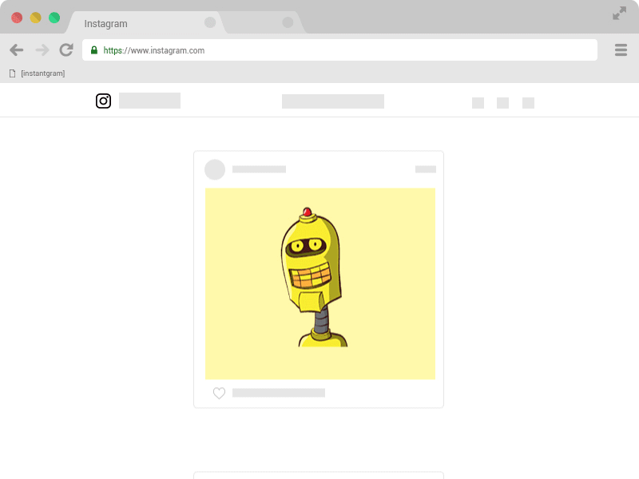

# [instantgram]

[Versão em Português =)](http://theus.github.io/instantgram/lang/pt-br)

[instantgram] is a bookmarklet with purpose of download instagram images. Tiny, simple, without necessity of extensions or downloads. Just access [this link][1] and drag the [instantgram] button to bookmark bar of your browser, navigate to the instagram.com (web), open a instagram post (photo) and click at bookmarklet. Just works.

### [:arrow_right: Bookmarklet][1]

:bulb: Now in version 2.1.0, [instantgram] can search images in screen. So, if you scrolling by your timeline, pause the scroll on image that you want and click in [instantgram]. Should work.

## Compatibility

|       Browser        |     Compatible?    |
| -------------------- | -------------------|
| Google Chrome        | :white_check_mark: |
| Mozilla Firefox      | :white_check_mark: |
| Internet Explorer 11 | :white_check_mark: |
| Edge*                | :warning:          |
*_aparently Edge don't allow drag a button to bookmark bar_

## Roadmap

- ~~a way of notify updates in [instantgram]~~ :heavy_check_mark: in v2.0.0
- ~~make a gif explaining the [instantgram]~~ :heavy_check_mark:
- ~~video :smirk_cat:~~ :heavy_check_mark: in v2.2.0

## Contributing

Read [CONTRIBUTING.md](CONTRIBUTING.md) for more informations. :heart:

## Changelog
- v2.4.0 - [instangram] now supports Stories.
- v2.3.0 - [instangram] now supports localization, both app and website. Initially it has en-US and pt-BR. You can help us translating [instantgram] for your language! Cool? Read [contributing](CONTRIBUTING.md) for more informations.
- v2.2.0 - [instantgram] now supports video too! :movie_camera:
- After v2.0.0, [instantgram] has your data saved in `localStorage` and can be accessed entering `localStorage.getItem('instantgram')` in console inside instagram.com. If you can't access this item, you may using a version before v2.0.0.

[1]:http://theus.github.io/instantgram
